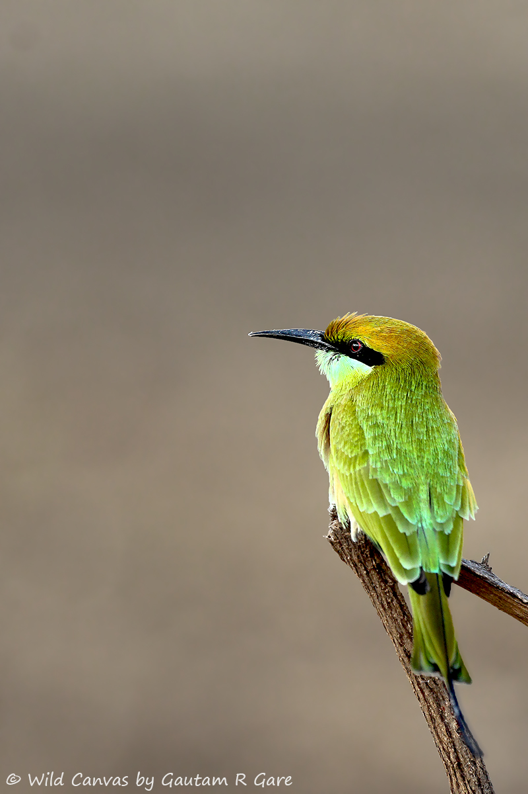

I am a wildlife photographer and conservationalist. Here are some of my wildlife clicks. 

<!--  

   -->

<!-- 

| {: width="200px"  height="200px"} | {: width="200px"  height="200px"} | {: width="200px"  height="200px"} |
| --- | --- | --- |
| {: width="200px"  height="200px"} | {: width="200px"  height="200px"} | {: width="200px"  height="200px"} |

 -->

  

      
      
      
      <!-- | --- | --- | --- | -->
      
      
      
      <!-- | --- | --- | --- | -->
      
      
      
      <!-- | --- | --- | --- | -->
      
      
      
      <!-- | --- | --- | --- | -->
      
      
      
      <!-- | --- | --- | --- | -->
      
      
      
  

<!-- 

<!--  -->
  <!-- <h2 class="year">{{y}}</h2> -->
  <!--  -->
<!--  -->

<!--  

   -->

<!-- 
  -->

<!-- 

 -->
